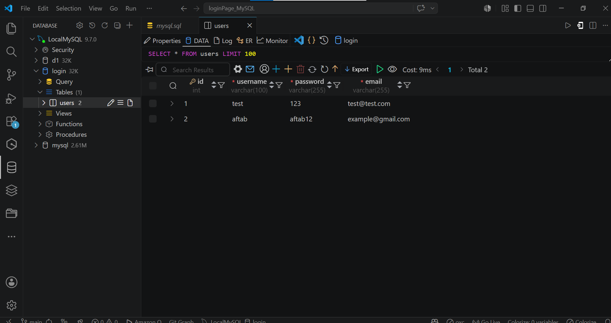

# Login Page with MySQL — C++

A console-based authentication system built in C++ with a MySQL backend.

---

## Local MySQL DB


---

## Features

- User Login with 3-attempt lockout
- User Signup
- Forgot Password (reset via registered email)
- Delete Account (requires password confirmation)
- Password masking (`*`) while typing
- SHA2-256 password hashing
- SQL injection protection via `mysql_real_escape_string`
- DB credentials loaded from `.env` file

---

## Prerequisites

- [MySQL Server 9.x](https://dev.mysql.com/downloads/mysql/)
- [MinGW / g++](https://www.mingw-w64.org/) (C++ compiler)
- `libmysql.dll` (included)

---

## Database Setup

Run the provided SQL file in your MySQL client:

```sql
source mysql.sql
```

This creates the `login` database and a `users` table with a test user:
- **Username:** `test` | **Password:** `test` | **Email:** `test@test.com`

Hash the test user's password after setup:

```sql
UPDATE users SET password = SHA2('test', 256) WHERE username = 'test';
```

---

## Configuration

Create a `.env` file in the project root (already included, never commit it):

```env
DB_HOST=localhost
DB_USER=root
DB_PASSWORD=your_password
DB_NAME=login
DB_PORT=3306
```

---

## Build & Run

```bat
build.bat
login.exe
```

> The build script uses `g++` and links against MySQL Server at `C:\Program Files\MySQL\MySQL Server 9.7`.  
> Make sure `.env` is in the same directory as `login.exe` when running.

---

## Project Structure

```
loginPage_MySQL/
├── main.cpp        # Application source
├── headers.h       # All includes and namespaces
├── mysql.sql       # Database schema & seed data
├── build.bat       # Build script
├── .env            # DB credentials (never commit this)
├── .gitignore      # Ignores .env and login.exe
├── libmysql.dll    # MySQL client library
└── login.exe       # Compiled binary
```

---

## Menu Options

| Option | Description |
|--------|-------------|
| 1 | Login — enter username + password |
| 2 | Sign Up — create a new account |
| 3 | Forgot Password — reset via registered email |
| 4 | Delete Account — requires username + password + `yes` confirmation |
| 5 | Exit |

---

## Security

- Passwords hashed with `SHA2(password, 256)` — never stored in plain text
- All queries use `mysql_real_escape_string` — no SQL injection
- Credentials loaded from `.env` — not hardcoded in source
- `.env` listed in `.gitignore` — safe to use with Git
- Delete account requires valid credentials before deletion
